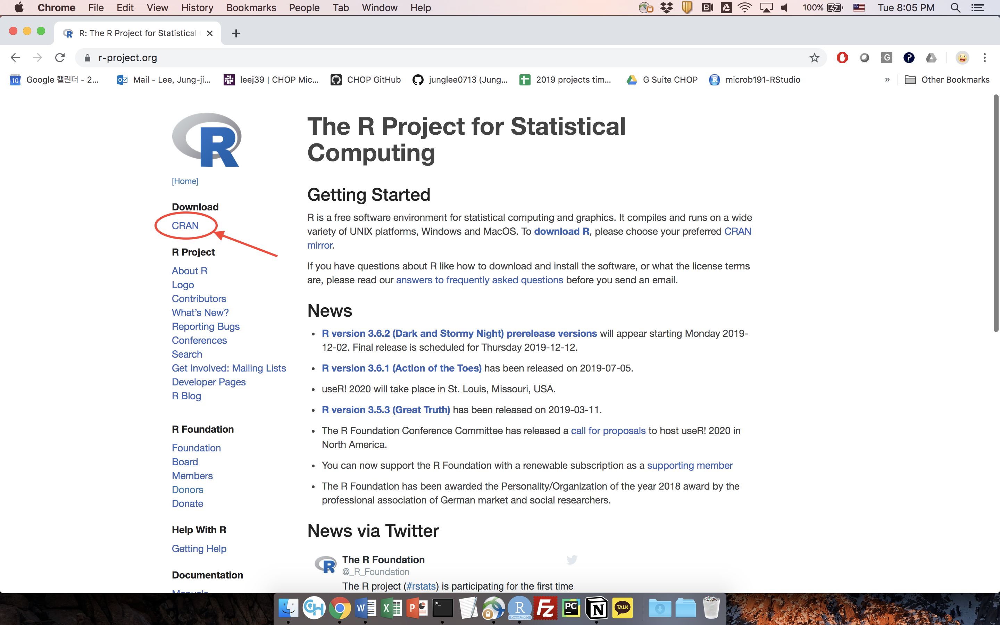
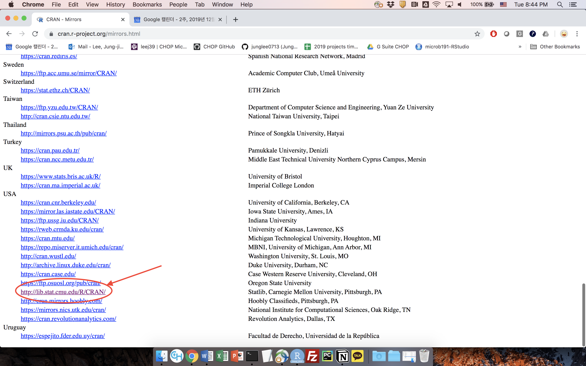
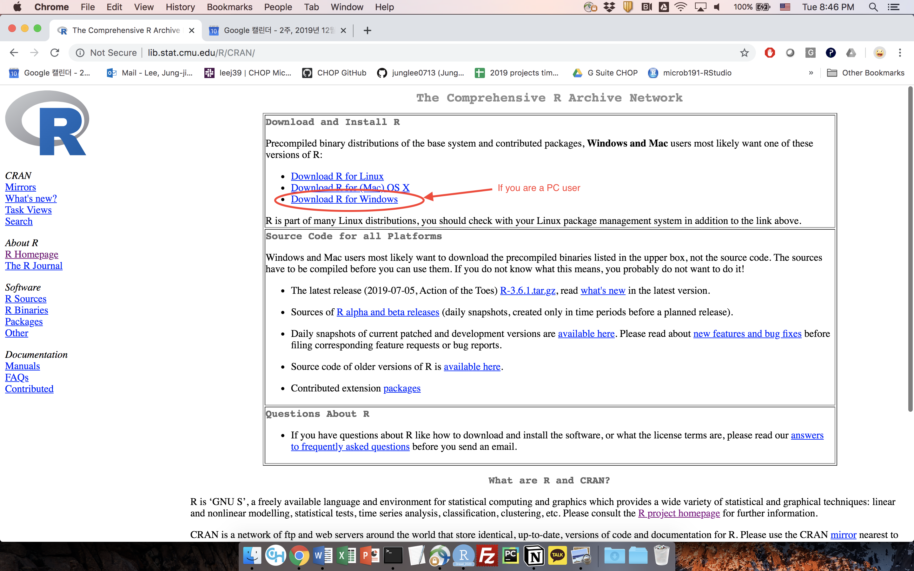
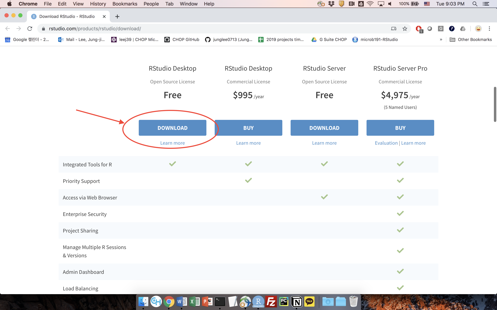
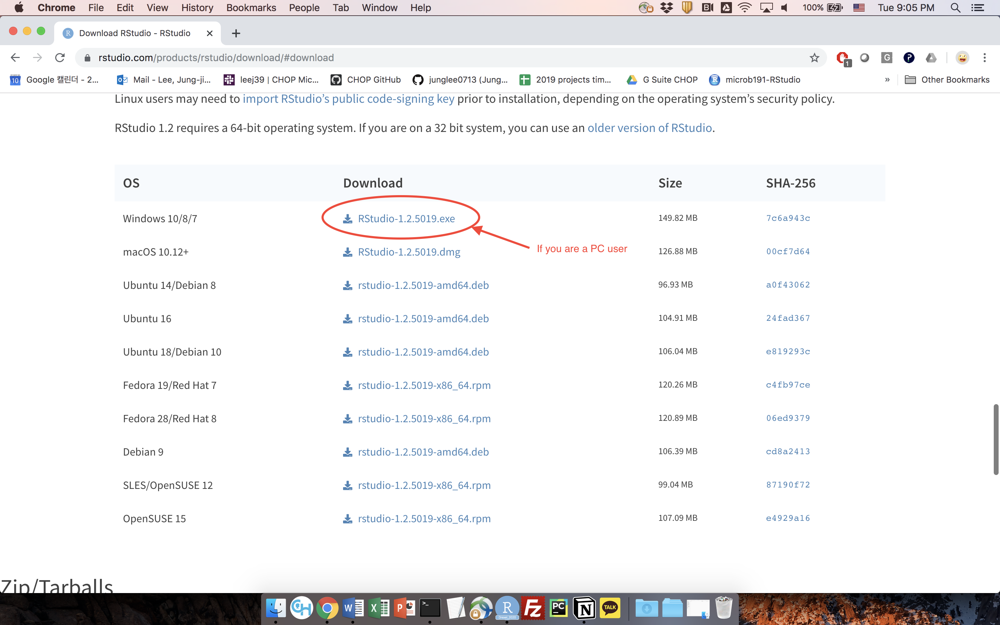
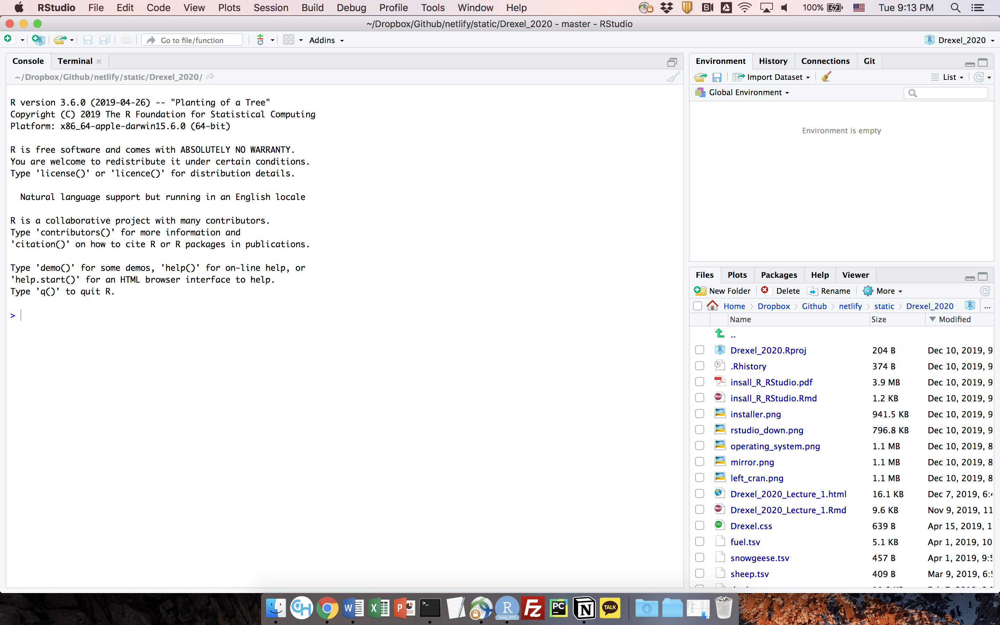
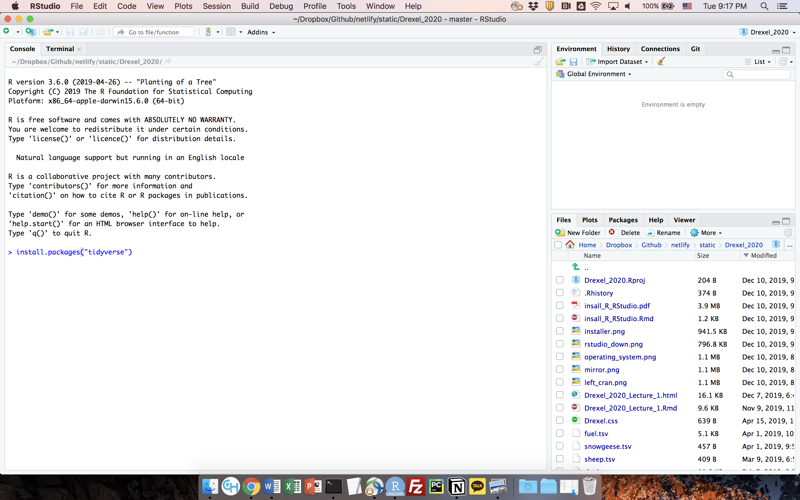
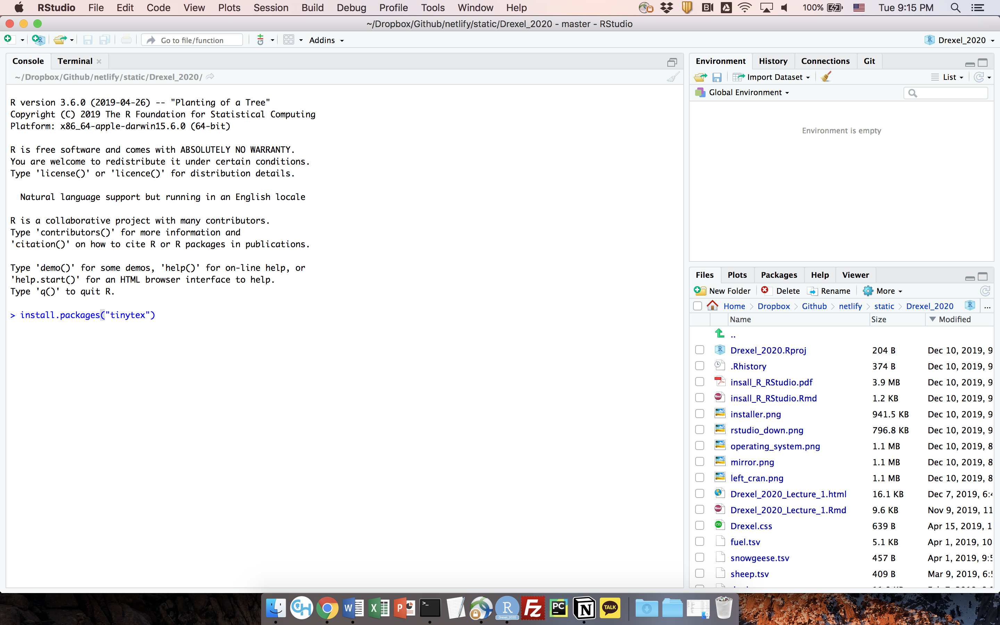
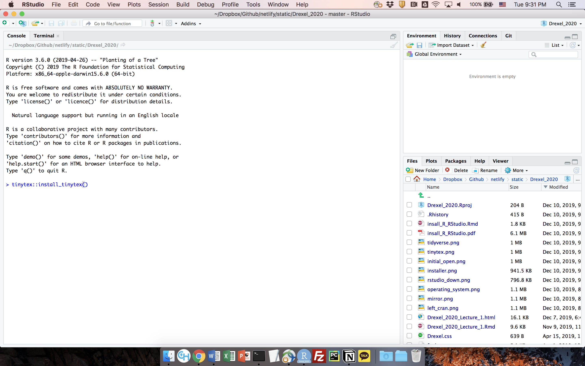
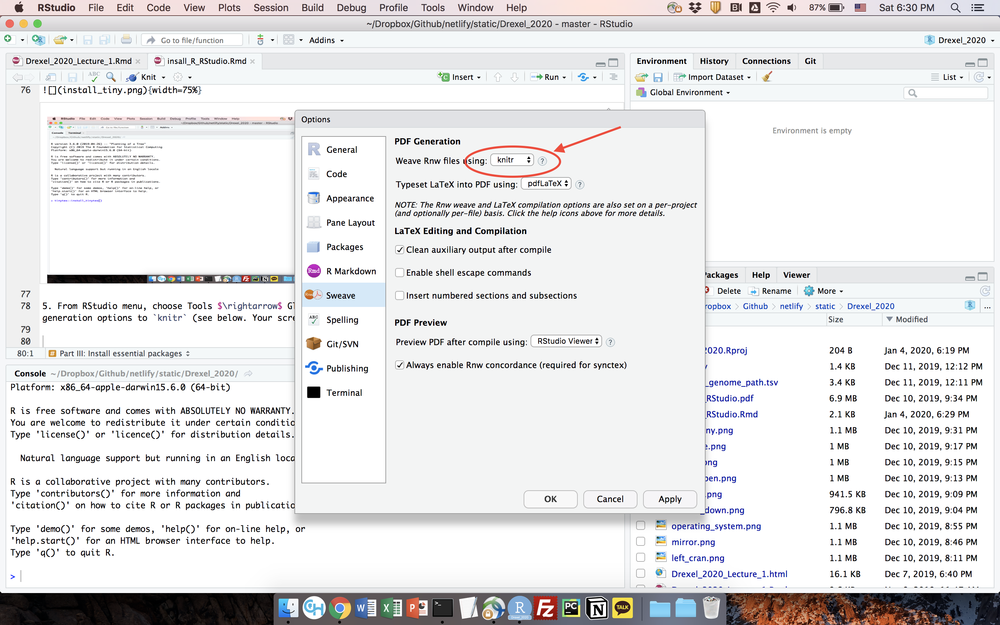

```{r, message = F, echo = F, warning = F}
library(tidyverse) 
library(knitr) 
opts_chunk$set(
  tidy = FALSE,
  cache = FALSE,
  echo = TRUE,
  warning = FALSE,
  message = FALSE,
  dpi = 300,
  fig.align = "center",
  fig.width = 3,
  fig.height = 3
  )
```

## Part I: Install R

1. Using your web browser, go to http://www.r-project.org/

2. Click on **CRAN** under **Download** on left (see below)

{width=75%}

\newpage

3. Choose any mirror site (usually closer sites tend to be better), e.g. http://lib.stat.cmu.edu/R/CRAN/ (see below)

{width=75%}

\bigskip
\bigskip
\bigskip

4. Choose a package corresponding to your operating system (see below). R supports Windows, Mac, and Linux. Follow instructions and install R.

{width=75%}

\newpage

## Part II: Install RStudio (Do it only after Part I is complete)

1. Using your web browser, go to https://rstudio.com/products/rstudio/download/

2. Choose free RStudio desktop version (see below)

{width=75%}

\bigskip
\bigskip
\bigskip

3. Choose an installer for your operating system and follow instructions (see below)

{width=75%}

\newpage

## Part III: Install essential packages

1. Open RStudio -- you should be able to see something similar to the following:

{width=75%}

\bigskip
\bigskip
\bigskip

2. Install a package called `tidyverse` by typing `install.packages("tidyverse")` and hitting enter (see below). This may take a while. 

{width=75%}

\newpage

3. Install a package called `tinytex` by typing `install.packages("tinytex")` and hitting enter (see below. Your screen may look different). This also may take a while. 

{width=75%}

\bigskip
\bigskip
\bigskip

4. Type `tinytex::install_tinytex()` (note the double colons :: between `tinytex` and `install_tinytex()`) and hit enter (see below. Your screen may look different) 

{width=75%}

\newpage

5. From RStudio menu, choose Tools $\rightarrow$ Global Options. Click on Sweave on the left and change PDF generation options to `knitr` (see below. Your screen may look different). 

{width=75%}